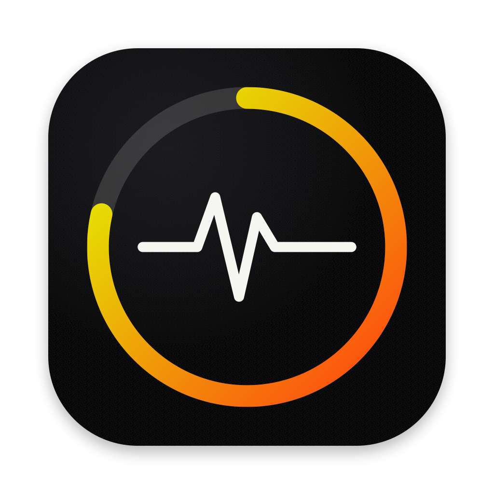

<p align="center">
  
</p>

<h1 align="center">Pulsession</h1>

<p align="center">
  <b>AI 编码额度和智能体会话，都在屏幕边缘的一排圆环里。</b><br>
  基于 <a href="https://github.com/qunqin24/Pulse">Pulse</a> 的分支，新增 PI-Desktop、Claude Code 与 Codex 的实时会话监控。
</p>

<p align="center">
  
  
  <a href="LICENSE"></a>
  <a href="https://github.com/qunqin24/Pulse"></a>
</p>

<p align="center">
  <sub><a href="README.md"><b>English</b></a> · <b>简体中文</b></sub>
</p>

---

## Pulsession 是什么

**[Pulse](https://github.com/qunqin24/Pulse)**（作者 qunqin24）是一个停靠在屏幕边缘的小巧悬浮监视器，显示 Claude Code、Codex、Cursor、Copilot 等七十多个 AI 编码服务还剩多少额度。Pulsession 完整保留了 Pulse 的一切：圆环、详情卡、动画机器人标记、液态玻璃、停靠位置、通知、Token 消耗，全部按 Pulse 原本的设计来。

Pulsession 在此基础上多加了**一个圆环**：**会话监控**。指向它，会弹出一张卡片，列出最近所有智能体会话、各自在做什么、做了多久；点一下某个会话，就会在它所在的 app 里打开。

它最初是 PI-Desktop 里的一个"会话监控"插件挂件。现在它是一个基于 Pulse 的独立 macOS 应用，不再依赖 PI-Desktop 的插件宿主。

## 会话监控

### 圆环

会话圆环排在浮动栏上账号圆环的后面，每个会话占一段弧。颜色沿用 Pulse 自己的含义：

| 颜色 | 含义 |
|---|---|
| 白色 | 运行中：有一轮任务正在进行 |
| 琥珀色 | 等你处理：有工具调用在等待授权 |
| 红色 | 上一轮失败 |
| 绿色 | 已完成（保留 30 分钟，之后变为空闲） |
| 灰色 | 已中断，或空闲 |

- **动画**：有会话在运行时，圆环内会转动 Pulse 的白色光点；有会话在等待授权时，圆环外会有一圈琥珀色的呼吸光。
- **机器人标记**：可以为这个圆环打开 Pulse 的动画机器人，一轮任务结束时它会庆祝一下。
- **数字**：圆环下方的数字是活动会话的数量，不是百分比。
- **保持展开**：有会话在运行或等你处理时，浮动栏会保持展开，不会收成细线。这一项可以关掉。

### 卡片

每一行显示：

- 状态标记
- 项目名
- 会话标题
- 状态与来源
- 已运行时间（正在运行时），或距上次变化多久

| 操作 | 结果 |
|---|---|
| **点击** Claude Code 会话 | 在 **Claude app** 的 Code 标签里打开（`claude://code/continue?session=…`） |
| **点击** Codex 会话 | 在 **Codex app** 里打开（`codex://threads/<id>`） |
| **点击** PI-Desktop 会话 | 通过 PI-Desktop 的本机控制端口直接打开该会话（见下文）；没开端口时只把 PI-Desktop 调到前台 |
| **点击** 只在终端里运行的会话 | 把 `cd <项目> && claude --resume <id>`（或 `codex resume <id>`）复制到剪贴板 |
| **右键**某一行 | 打开 · 复制恢复命令 · 在访达中显示项目 · **隐藏至下一轮结束** · **归档** |
| **点击**圆环本身 | 立即重新读取所有会话 |

隐藏和归档只影响 Pulsession 的显示，不会改动会话本身。隐藏的会话会在它下一轮任务结束时自动回来；归档的会话要到**设置 › 会话**里手动恢复。

### 数据来源

全部在本机读取，只读，不上传任何内容。

| 来源 | 读取位置 | 能显示的状态 |
|---|---|---|
| **PI-Desktop** | `~/.pi-desktop/pi.sqlite`（会话、项目、每轮任务）和 `logs/app/permission.log` | 运行中、等待授权、已完成、失败、已中断 |
| **Claude Code** | `~/.claude/projects/**/*.jsonl` 中过去一天的记录，以及 Claude app 自己的会话索引（用于标题和跳转链接） | 运行中、已完成、已中断 |
| **Codex** | `~/.codex/sessions/**/*.jsonl` 中过去一天的记录 | 运行中、已完成、已中断 |

- Claude Code 和 Codex 的"运行中/已完成"判断，与 Pulse 活动光点用的是同一套精确规则：读 `stop_reason`，以及 `task_started` / `task_complete`。
- 这两个工具的记录里分不清"在等授权"和"工具跑得慢"，所以 Pulsession 不会去猜。
- 每个来源都可以在**设置 › 会话**里单独关闭。

### PI-Desktop 控制端口

PI-Desktop 没有 URL scheme。要打开某个**具体**的 PI-Desktop 会话、并准确读取授权状态，Pulsession 会使用 PI-Desktop 自带的本机 MCP 控制服务。

- **何时开启**：只有用 `PI_DESKTOP_MCP_CONTROL=1` 启动 PI-Desktop 时，它才会开启这个服务。
- **如何打开**：在**设置 › 会话 › 重启并打开控制**里操作。会先弹窗确认，再退出并重新打开 PI-Desktop。退出会中断正在进行的任务。
- **安全范围**：端口只在 `127.0.0.1` 上监听。令牌从 PI-Desktop 自己的文件读取，不会离开这台 Mac，也不走任何代理。
- **不开启时**：其他功能照常可用。授权状态改从授权日志推断，点击会把 PI-Desktop 调到前台。

## 其余功能都来自 Pulse

Pulse 的全部功能原样保留：

- 智能着色的用量圆环
- 列出每条限额与重置时间的详情卡
- 可选的消耗速率预测、时间窗口弧和第二圆环
- 动画机器人标记
- 左、右、顶部边缘停靠
- 液态玻璃
- 多显示器
- 可选通知
- 覆盖 50 多个本地客户端的 Token 消耗统计
- `--json` 输出、扩展与开发者集成

完整介绍和服务商列表见 [Pulse 的 README](https://github.com/qunqin24/Pulse/blob/main/README.zh-CN.md)。本仓库代码的设计说明见 [Docs/](Docs/README.md)（英文）。

## 安装

目前还没有预编译版本，需要从源码构建。

**要求**：运行需要 macOS 14 或更新。构建需要 **Xcode 26 或更新**（macOS 26 SDK），并用 `xcode-select` 选中它。

```bash
git clone https://github.com/jasperhan99/pulsession.git
cd pulsession
./Scripts/bundle.sh
open build.noindex/Pulsession.app
```

想长期使用的话，把 `Pulsession.app` 移到"应用程序"文件夹。构建产物是临时签名（ad-hoc），从别处下载的副本第一次打开可能需要**右键 › 打开**。

首次启动时，至少选择一个要监控的服务，浮动栏（以及上面的会话圆环）才会出现。和 Pulse 一样，Pulsession 第一次运行时会打开**登录时启动**，可以在**设置 › 通用**里关掉。

## 与 Pulse 的区别

Pulsession 可以和已安装的 Pulse 同时运行，互不共享任何数据：

| | Pulse | Pulsession |
|---|---|---|
| Bundle ID | `io.github.qunqin24.Pulse` | `io.github.jasperhan.pulsession` |
| 数据目录 | `~/Library/Application Support/Pulse` | `~/Library/Application Support/Pulsession` |
| URL scheme | `pulse://` | `pulsession://` |
| 更新 | Sparkle 自动更新 | 暂无，需重新构建 |
| 会话监控 | — | ✓ |

包内的 Swift 模块和可执行目标仍叫 `Pulse`，只有打包出来的 app 叫 Pulsession。

## 开发

```bash
swift build
swift test
./Scripts/check-localization.sh
```

- **结构**：会话监控的代码在 `Sources/Pulse/Sessions/`。对上游文件的改动都集中在少数带注释的接入点。设计、依据和约束见 [Docs/sessions.md](Docs/sessions.md)（英文）。
- **上游规范**：Pulse 关于面板几何、输入、本地化和证据的规范依然适用，见 [CLAUDE.md](CLAUDE.md)、[CONTRIBUTING.md](CONTRIBUTING.md) 和 [Docs/](Docs/README.md)。
- **界面语言**：界面支持英文、简体中文、繁体中文、日语和韩语。

## 致谢

- **[Pulse](https://github.com/qunqin24/Pulse)**（qunqin24 及贡献者）是 Pulsession 的基础，会话监控以外的一切都出自他们之手。如果只需要额度监控，请直接使用 Pulse。
- Pulse 的设计灵感来自 [**Vinz**（@hivinz_）](https://x.com/hivinz_/status/2092996055248126353) 在 X 上分享的界面概念。
- 服务商图标来自 [Lobe Icons](https://github.com/lobehub/lobe-icons)。动画标记及其他随附素材沿用各自的许可，见 [THIRD_PARTY_NOTICES.md](THIRD_PARTY_NOTICES.md)。

## 许可

与 Pulse 一样，采用 [Apache 2.0](LICENSE)。Pulsession 做了哪些修改，见 [NOTICE](NOTICE)。
